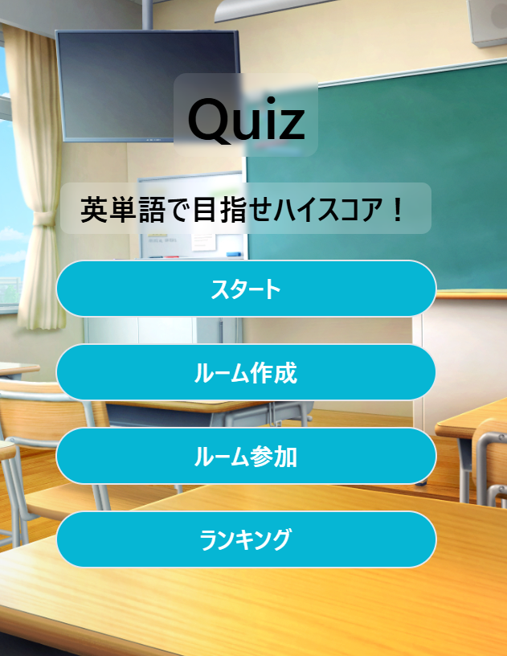

<div id="top"></div>

# 英単語クイズアプリ



## 概要

英単語のクイズアプリです。

- **難易度変化**
  - スコアに応じて問題の難易度を変化させます。
- **ランキング**
  - 名前とスコアをデータベースに保存しランキングを作成します。
- **英単語読み上げ**
  - Web Speech APIによって英単語が読み上げられます。
- **オンライン対戦**
  - ポーリングによってデータベースの変更を検知して対戦機能を実装しました。

## 技術スタック

- JavaScript
- Vite
- Svelte
- Tailwind CSS
- Supabase
  - データベースに問題、スコア、対戦に必要な情報（ルームid、参加者の状態など）を保存し、必要に応じてreadしたりupdateしたりします。
- PostgreSQL
- Web Speech API

## 環境構築

```sh
npm create vite@latest
npx svelte-add tailwindcss
npm install @supabase/supabase-js
cd プロジェクト名
npm install
npm run dev
```

<p>環境構築が終わったらsrcフォルダ内のApp.svelteにソースコードを記述します。<br>
ファイルを分割する際はsrcフォルダ内にファイルを作成します。</p>

<p align="right">(<a href="#top">トップへ</a>)</p>
